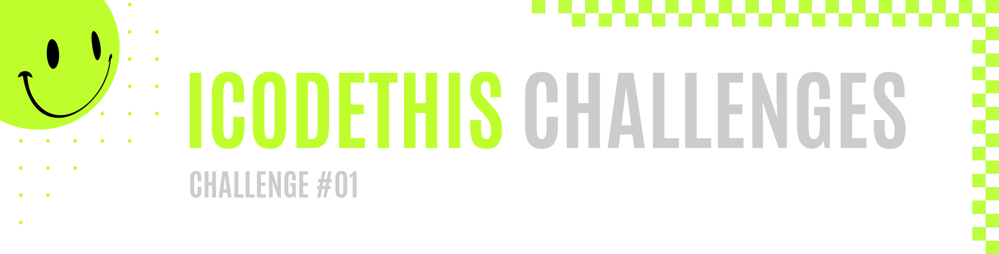

 
 

|         |               
| :-------------:|
|   |
| **Challenge #01:** Social Login   | 
| **Original Project:** [🌐](https://github.com/malunaridev/Challenges-iCodeThis/blob/master/1-social-login/assets/Readme-files/example.jpg?raw=true) / **My Code:** [📄](https://github.com/malunaridev/Challenges-iCodeThis/tree/master/1-social-login) / **Live Preview:** [🌐](https://challenges-ict-social-login.vercel.app/)  

 
 

This is the first challenge from iCodeThis!
I found iCodeThis when I was randomly looking for a daily challenge to keep me coding everyday. Since I want to keep up my GitHub activity, I was really glad when I finally found an active community for daily challenges, but they were around Challenge #104, I guess. I took a look at their past challenges and I found myself really excited to participate, so I joined one. It was really fun, and then I've decided to start from #01! I can do more than 1 per day, so I expect to keep up with the community soon.

 
 
 

- HTML
- CSS

 
 
 

|  Validator  | Passed |
| ------------- | :-------------: |
|[Markup Validation Service](https://validator.w3.org/) - <em>w3.org</em> |   |
|[CSS Validation Service](https://jigsaw.w3.org/css-validator/) - <em>w3.org</em> |   |

 
 
 

It was really interesting to apply classes to images. I needed square ones to save me more time, so i searched for "icons". They are supposed to be profile pictures, and I randomly choose some that matchs the color. I guess it helps with the visuals.
Also, it was my first time using an icon next to a input form, so I had some trouble to center the arrow. It worked out well with the <code>display: table-cell</code> and it was new to me.

 
 
 

