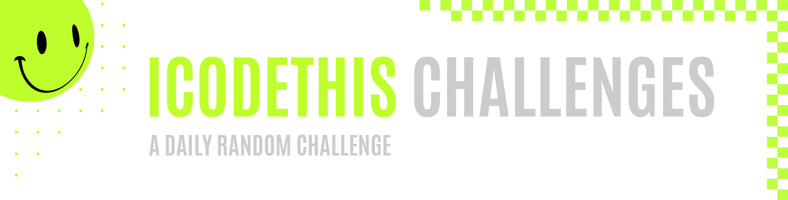
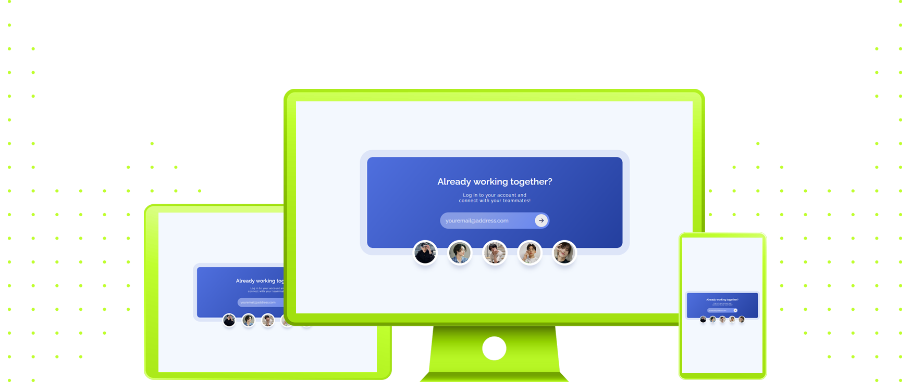
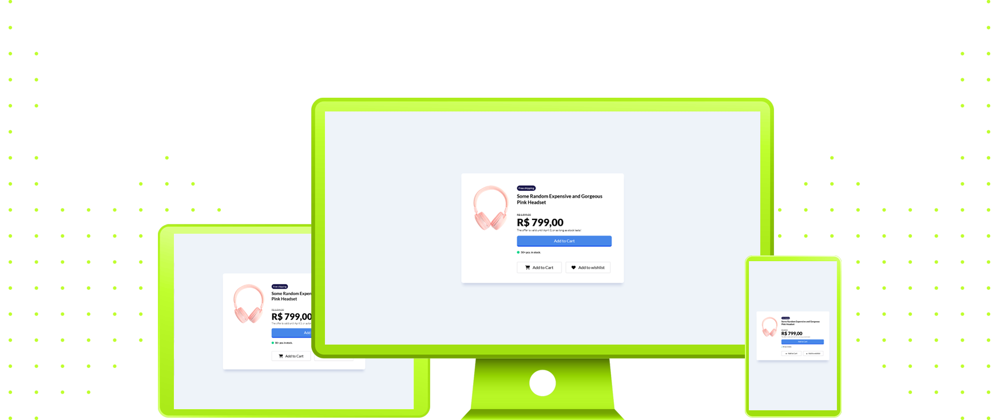
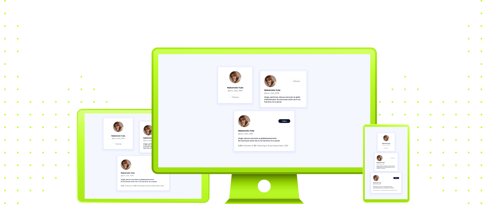

 
 

I found iCodeThis when I was randomly looking for a daily challenge to keep me coding everyday. Since I want to keep up my GitHub activity, I was really glad when I finally found an active community for daily challenges, but they were around Challenge #104, I guess. I took a look at their past challenges and I found myself really excited to participate, so I joined one. It was really fun, and then I've decided to start from #01! I can do more than 1 per day, so I expect to keep up with the community soon.
 
 
 
 

|         |             |    
| :-------------:|:-------------:|
|  |   |
| **Challenge #01:** Social Login   | **Challenge #02:** Mobile Menu 
| **Code:** [📄](https://github.com/malunaridev/Challenges-iCodeThis/tree/master/1-social-login) \| **Live Preview:** [🌐](https://challenges-ict-social-login.vercel.app/) | **Code:** [📄](https://github.com/malunaridev/Challenges-iCodeThis/tree/master/2-mobile-menu) \| **Live Preview:** [🌐](https://challenges-ict-2-mobile-menu.vercel.app/) 

|         |             |    
| :-------------:|:-------------:|
|   |   |
| **Challenge #03:** Cart Item   | **Challenge #04:** Leaderboard  
| **Code:** [📄](https://github.com/malunaridev/Challenges-iCodeThis/tree/master/3-cart-item) \| **Live Preview:** [🌐](https://challenges-ict-3-cart-item.netlify.app/)   | **Code:** [📄](https://github.com/malunaridev/Challenges-iCodeThis/tree/master/4-leaderboard) \| **Live Preview:** [🌐](https://challenges-ict-4-leaderboard.netlify.app/) 

|         |             |    
| :-------------:|:-------------:|
|    |   |
| **Challenge #05:** Friend Request   | **Challenge #06:** Expenses Graph  
| **Code:** [📄](https://github.com/malunaridev/Challenges-iCodeThis/tree/master/5-friend-request) \| **Live Preview:** [🌐](https://challenge-ict-5-friend-request.netlify.app/)  | **Code:** [📄](https://github.com/malunaridev/Challenges-iCodeThis/tree/master/6-expenses-graph) \| **Live Preview:** [🌐](https://challenge-ict-6-expenses-graph.netlify.app/) 

|         |             |    
| :-------------:|:-------------:|
|    |   |
| **Challenge #07:** Social Profile   | **Challenge:** Product Page  
| **Code:** [📄](https://github.com/malunaridev/Challenges-iCodeThis/tree/master/7-social-profile) \| **Live Preview:** [🌐](https://challenge-ict-7-social-profile.netlify.app/)  | **Code:** [📄](https://github.com/malunaridev/Challenges-iCodeThis/tree/master/1-product-page) \| **Live Preview:** [🌐](https://challenges-ict-product-page.vercel.app/) 

 
 
 

